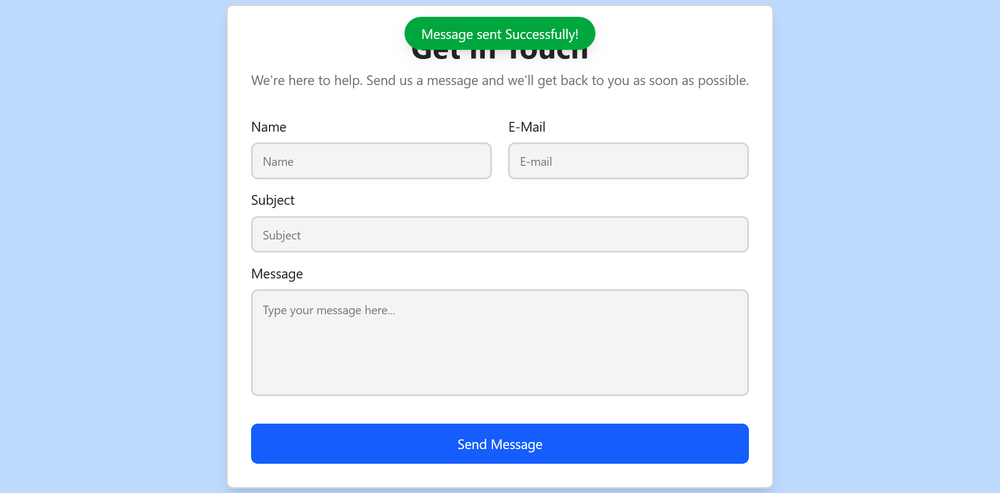

# React Contact Form with EmailJS

A modern and responsive contact form built using React, Tailwind CSS, and EmailJS API. Users can send messages directly through the form with real-time notifications and auto-reply functionality.

## 🚀 Live Demo
https://vikaspawar-dev.github.io/react-contact-form-emailjs/

---

## 📌 Features
- Responsive Contact Form
- Email Sending with EmailJS
- Auto Reply Email
- Success & Error Notifications
- Modern UI Design
- Built with React & Tailwind CSS

---

## 🛠 Technologies Used
- React.js
- Tailwind CSS
- EmailJS API
- Vite
- Git & GitHub

---

## 📷 Screenshots

### Contact Form UI


### Success Notification


---

## ⚙️ Installation

Clone the repository:

```bash
git clone https://github.com/vikaspawar-dev/react-contact-form-emailjs.git
```

Install dependencies:

```bash
npm install
```

Start the development server:

```bash
npm run dev
```

---

## 📬 Contact
Vikas Pawar
